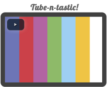

# Tube-n-tastic!

Browser based home entertainment center (HEC) running on HTTP.



**Future Plans**
* Move file browser to top, and have it drop down for when the user wants to select a file
* Find out how to support more video and audio file formats!
* Connect via HTTP to HEC using mobile phone to act as a remote, Examples:
	* Adjust volume / pause, even when you are not in the same room
	* Append to playlist
* File search: when you press enter in the search textbox, add all highlighted to playlist

## TECHNOLOGIES

**NodeJS**

	Express, Mime, DBLite

**JavaScript**

	jQuery, jQuery UI, video.js, jstree

## MIME SUPPORT

	"video/mp4", "video/webm", "video/ogg", "video/ogv"

## INSTALL LINUX

**NodeJS**

```
> sudo apt-get update
> sudo apt-get install build-essential
> sudo apt-get install nodejs
> sudo apt-get install npm
> sudo ln -s /usr/bin/nodejs /usr/bin/node
```

**NodeJS Plugins**

```
> npm install express
> npm install dblite
> npm install mime
```

## RUN

```
> nodejs tube.js <port>
```

**Note:** *port* is optional and defaults to 8080

## LOAD

Store your videos in *./www/videos*
